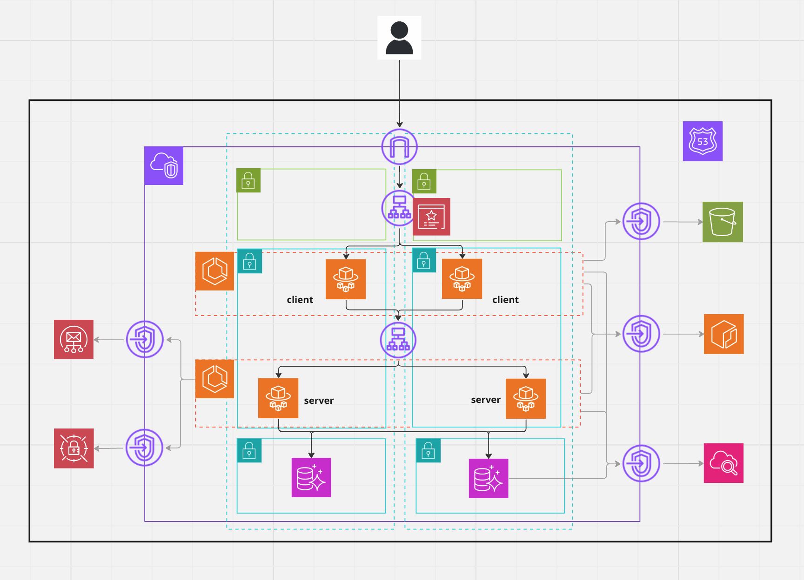

## What is

Calendar 

## infra configuration

<div style="display: flex; justify-content: center; align-items: center; width: 80%; margin: 0 auto;">
    
</div>

## How to set up infra

1. Create symbolic link

```shell
(~/environments/stg) ln -s provider.tf ../../provider.tf
```

1. Create S3 bucket for terraform backend

```shell
aws s3api create-bucket --bucket sharely-terraform-state-bucket --region ap-northeast-1 --create-bucket-configuration LocationConstraint=ap-northeast-1
```

1. Create Dynamo DB for terraform backend rock

```shell
aws dynamodb create-table --table-name sharely-terraform-up-and-running-locks \
  --attribute-definitions AttributeName=LockID,AttributeType=S \
  --key-schema AttributeName=LockID,KeyType=HASH \
  --provisioned-throughput ReadCapacityUnits=5,WriteCapacityUnits=5 \
  --region ap-northeast-1
```

1. Terraform init

```shell
(~/environments/stg) terraform init
```

1. Encrypt s3 bucket

```shell
aws s3api put-bucket-encryption --bucket sharely-terraform-state-bucket --server-side-encryption-configuration '{"Rules": [{"ApplyServerSideEncryptionByDefault": {"SSEAlgorithm": "AES256"}}]}'
```

1. Set Versioning to s3 bucket

```shell
aws s3api put-bucket-versioning --bucket sharely-terraform-state-bucket --versioning-configuration Status=Enabled
```

## Supplement

### infra

- Format tf file

```shell
terraform fmt
```

- Validate tf file

```shell
terraform validate
```

- Lint tf file

```shell
tflint
```

- Create Terraform document

```shell
terraform-docs markdown table --output-file README.md .
```

- Check what will be created

```shell
terraform plan
```

- Create resource

```shell
AWS_PROFILE=sharely terraform apply -var-file="stg.tfvars"
```

- Delete resource

```shell
AWS_PROFILE=sharely terraform destroy -var-file="stg.tfvars"
```
